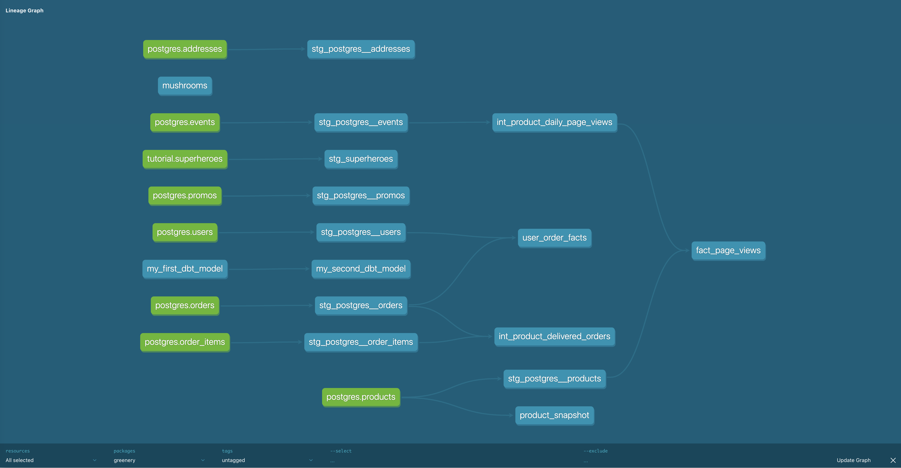

# Part 1. Models

### Question: What is our user repeat rate?

**Answer:** 80%

**Query:**  
```sql
WITH orders_chort AS (
    SELECT 
        user_id,
        COUNT(DISTINCT order_id) AS user_orders
    FROM DEV_DB.DBT_FREDDIEZENTENOOUTLOOKCOM.STG_POSTGRES__ORDERS
    GROUP BY 1 
), 
users_buckets AS (
    SELECT 
        user_id,
        IFF(user_orders >= 2, 1, 0) AS has_two_plus_purchases
    FROM orders_chort
) 
SELECT 
    SUM(has_two_plus_purchases) AS two_plus_purchases,
    COUNT(DISTINCT user_id) AS num_users_w_purchases,
    DIV0(two_plus_purchases, num_users_w_purchases) AS repeat_rate 
FROM users_buckets
```

---

### Question: What are good indicators of a user who will likely purchase again? What about indicators of users who are likely NOT to purchase again? If you had more data, what features would you want to look into to answer this question?

**Answer:**  
If we had more data, it would be interesting to see if users leave any reviews about our products or their experience shopping on our site. Additionally, we could look at how often they visit a site for an individual product they have yet to purchase but have signaled interest in a product. For users who are not likely to buy again, we could look at data regarding returns and if they have had a bad experience receiving the product or the product themselves. We could also look at customer experience information regarding their negative experience and determine whether they were satisfied with the resolution.

### Question: Explain the product mart models you added. Why did you organize the models in the way you did?

**Answer:**  
I organized my models by creating separate folders for intermediate models and marts. For the product, I made the `int_product_daily_page_views`, a view used to develop `fact_page_views`, where each row represents page view activity on a given day for an individual product. I can then use the `fact_page_views` to create a query by joining the data with the `int_product_delivered_orders` view by the product_id and the daily date to identify which products have better conversion rates (completed orders / page views). I then created the `user_order_facts` model under the marketing marts folder to gather order information regarding all our users, including those who have not placed an order yet. This will provide readily available information to our stakeholders who need to know about user orders.




---

# Part 2. Tests

### Question: What assumptions are you making about each model? (i.e. why are you adding each test?)  
Did you find any “bad” data as you added and ran tests on your models? How did you go about either cleaning the data in the dbt model or adjusting your assumptions/tests?

**Answer:**  
I added the `unique` and `not_null` tests to the primary key for all of the staging models. However, upon running the tests, I noticed that I incorrectly assumed that the `order_id` under the `order_items` table was unique. This column does not have a unique value since the uniqueness comes from the combination of the `order_id` and `product_id`. I then removed the unique test and only left the `not_null` test.

---

# Part 3. dbt Snapshot

### Question: Which products had their inventory change from week 1 to week 2?

**Answer:**  
- **Monstera** went from 77 to 64  
- **Philodendron** went from 51 to 25  
- **Pothos** went from 40 to 20  
- **String of pearls** went from 58 to 10  
