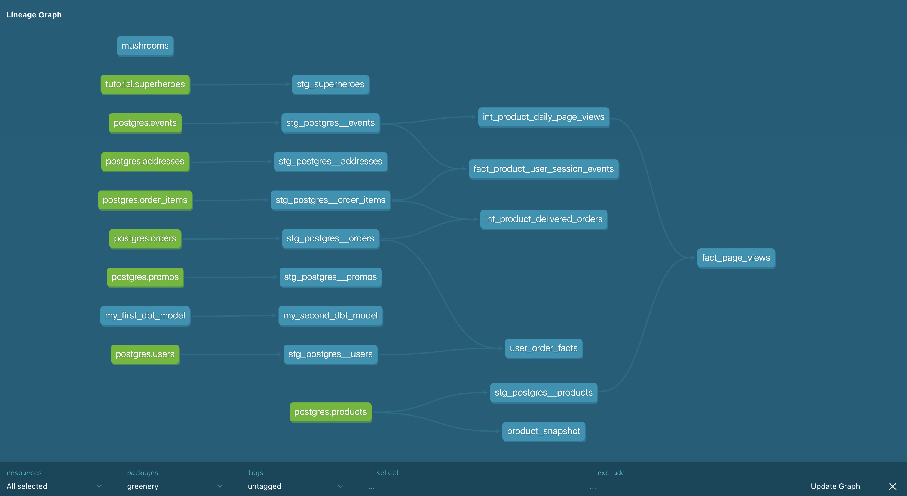

## Part 1: Create New Models to Answer Questions

### Question 1: What is our overall conversion rate?
**Answer:** 62%

```sql
select 
  count(distinct case when checkout > 0 then session_id else null end) as purchase_event,
  count(distinct case when page_view > 0 then session_id else null end) as unique_session,
  count(distinct case when checkout > 0 then session_id else null end) / count(distinct case when page_view > 0 then session_id else null end) as overall_conversion_rate
from DEV_DB.DBT_FREDDIEZENTENOOUTLOOKCOM.FACT_PRODUCT_USER_SESSION_EVENTS
```

### Question 2: What is our conversion rate by product?

```sql
select 
  p.name, 
  count(distinct case when checkout > 0 then session_id else null end) / count(distinct case when page_view > 0 then session_id else null end) as overall_conversion_rate
from DEV_DB.DBT_FREDDIEZENTENOOUTLOOKCOM.FACT_PRODUCT_USER_SESSION_EVENTS e 
left join DEV_DB.DBT_FREDDIEZENTENOOUTLOOKCOM.STG_POSTGRES__PRODUCTS p 
on e.product_id = p.product_id
group by 1
order by 2 desc 
```

| Product            | Conversion Rate |
|--------------------|-----------------|
| String of pearls   | 61%            |
| Arrow Head         | 56%            |
| Cactus             | 55%            |
| ZZ Plant           | 54%            |
| Bamboo             | 54%            |
| Rubber Plant       | 52%            |
| Monstera           | 51%            |
| Calathea Makoyana  | 51%            |
| Fiddle Leaf Fig    | 50%            |
| Majesty Palm       | 49%            |
| Aloe Vera          | 49%            |
| Devil's Ivy        | 49%            |
| Philodendron       | 48%            |
| Jade Plant         | 48%            |
| Spider Plant       | 47%            |
| Pilea Peperomioides | 47%           |
| Dragon Tree        | 47%            |
| Money Tree         | 46%            |
| Orchid             | 45%            |
| Bird of Paradise   | 45%            |
| Ficus              | 43%            |
| Birds Nest Fern    | 42%            |
| Pink Anthurium     | 42%            |
| Boston Fern        | 41%            |
| Alocasia Polly     | 41%            |
| Peace Lily         | 41%            |
| Ponytail Palm      | 40%            |
| Snake Plant        | 40%            |
| Angel Wings Begonia | 39%           |
| Pothos             | 34%            |

---

## Part 2: DBT Macro Creation

To improve the modularity and usability of my DBT models, I created a macro named `count_event_types`, designed to simplify and standardize counting different event types within a model. Large CASE statements for counting events across multiple event types are often repeated across models, making them a great candidate for a macro.

**Macro Creation** \
I created two macros:
- **`sum_event_types`**: This macro simplifies individual CASE statements by taking the event column and event type as parameters, returning a summed count of the specified event type.
- **`count_event_types`**: This macro further abstracts the logic by taking a list of event types and dynamically generating SQL to count each event type in one command. This prevents repetition and improves readability by allowing the macro to handle all event type counting in a model.


The `count_event_types` macro is used in the `fact_product_user_session_events` model, which is a newly created model. 

---

## Part 3: Grant Permissions in Snowflake

Since we are planning to grant permissions to our dbt models in our Snowflake database so that other roles can access them, I added a post-hook to apply grants to the role **"reporting"**. The `grant.sql` file can be found in the macros directory. My `dbt_project.yml` file was also updated. 

---

## Part 4: Install and Apply DBT Packages

After learning about dbt packages, I installed the **dbt-utils** package and applied the **expect_column_values_to_be_in_set** macro to ensure expected values are in the `event_type` column in the staging model (`stg_postgres__events`). This was added in `_postgres__models.yml`.

---

## Part 5: Showcasing Improvements with DBT Docs and DAGs

This updated DAG illustrates my newly created model called `fact_product_user_session_events`



---

## Part 6: DBT Snapshots

To monitor data changes, I ran the **products snapshot** model using `dbt snapshot` and queried Snowflake to see changes since last week.

### Products with Inventory Changes from Week 2 to Week 3
- Pothos
- Philodendron
- Bamboo
- ZZ Plant
- Monstera
- String of pearls

```sql
select 
  *
from DEV_DB.DBT_FREDDIEZENTENOOUTLOOKCOM.PRODUCT_SNAPSHOT
where true 
  and dbt_valid_from = '2024-10-27 22:34:00.404'
  and dbt_valid_to is null 
order by product_id, dbt_valid_from
```
