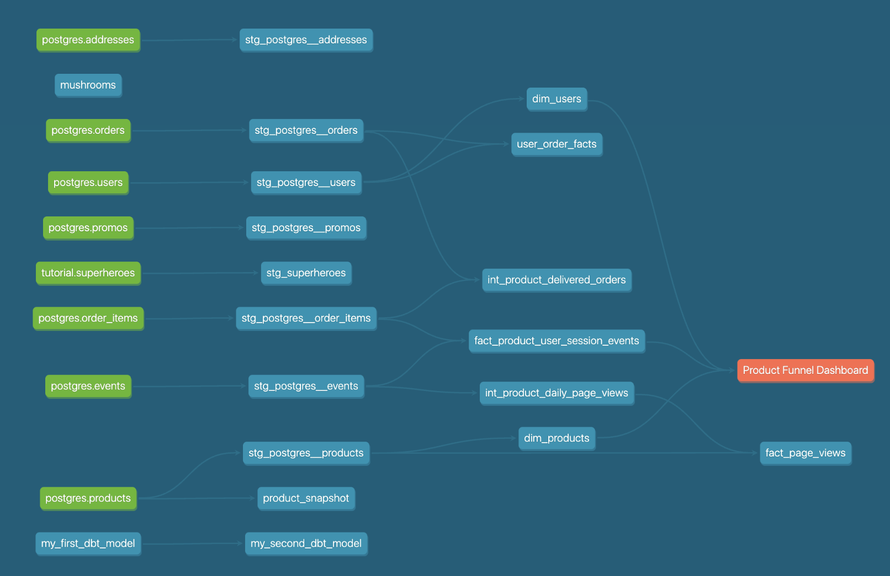
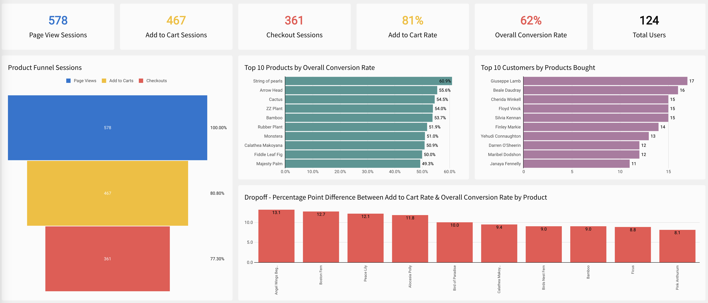

## Part 1. dbt Snapshots

### Question:
Which products had their inventory change from week 3 to week 4?

- Pothos
- Philodendron
- Bamboo
- ZZ Plant
- Monstera
- String of pearls

### Question:
Now that we have 3 weeks of snapshot data, can you use the inventory changes to determine which products had the most fluctuations in inventory? Did we have any items go out of stock in the last 3 weeks?

**Answer:**
Yes, Pothos and String of pearls went out of stock in week 3. See SQL script below:

```sql
WITH weekly_inventory AS (
    SELECT
        PRODUCT_ID,
        NAME,
        INVENTORY,
        DATE(DBT_UPDATED_AT) AS DBT_UPDATED_AT
    FROM DEV_DB.DBT_FREDDIEZENTENOOUTLOOKCOM.PRODUCT_SNAPSHOT
),
weekly_pivot AS (
    SELECT 
        PRODUCT_ID,
        NAME,
        MAX(CASE WHEN DBT_UPDATED_AT = '2024-10-13' THEN INVENTORY END) AS week_1,
        MAX(CASE WHEN DBT_UPDATED_AT = '2024-10-21' THEN INVENTORY END) AS week_2,
        MAX(CASE WHEN DBT_UPDATED_AT = '2024-10-27' THEN INVENTORY END) AS week_3,
        MAX(CASE WHEN DBT_UPDATED_AT = '2024-11-04' THEN INVENTORY END) AS week_4
        -- Add additional weeks as needed
    FROM weekly_inventory
    GROUP BY PRODUCT_ID, NAME
),
agg_cte AS (
    SELECT 
        PRODUCT_ID,
        NAME,
        COALESCE(week_1, 0) AS week_1,
        COALESCE(week_2, week_1, 0) AS week_2,
        COALESCE(week_3, week_2, week_1, 0) AS week_3,
        COALESCE(week_4, week_3, week_2, week_1, 0) AS week_4
    FROM weekly_pivot
    ORDER BY PRODUCT_ID
)

SELECT
    *
FROM agg_cte
WHERE true 
AND 
(week_1 = 0 OR 
 week_2 = 0 OR 
 week_3 = 0 OR 
 week_4 = 0)
```

---

## Part 2. Modeling Challenge

### Question:
How are our users moving through the product funnel?

- 81% of sessions result in users adding products to cart, and there is an overall 62% conversion rate.

### Question:
Which steps in the funnel have the largest drop-off points?

**Answer:**
Only 77% of add-to-cart sessions make it to the checkout section. In contrast, only 81% of page views make it to the add-to-cart section, indicating a more significant drop-off when funneling through the checkout section from the add-to-cart section.





---

## Part 3: Reflection Questions (3A)

### Question 3A:

**Question:** If your organization is thinking about using dbt, how would you pitch the value of dbt/analytics engineering to a decision-maker at your organization?

- **Answer:**
If my organization is considering dbt, I'd pitch it as a tool that standardizes data transformations, making workflows more efficient and improving data trust. It also enhances collaboration across teams with clear data lineage, simplifying data governance.

**Question:** If your organization is using dbt, what are 1-2 things you might do differently / recommend to your organization based on learning from this course?

- **Answer:**
If we're already using dbt, I'd suggest implementing modular macros to reduce code redundancy, make maintenance more manageable, and recommend consistent naming conventions to improve readability and onboarding.

**Question:**
If you are thinking about moving to analytics engineering, what skills have you picked up that give you the most confidence in pursuing this next step?

- **Answer:**
I feel confident about moving to analytics engineering because of my strong SQL skills, which help with efficient and reliable data transformations, and my understanding of data modeling, which ensures well-structured, analysis-ready data.
